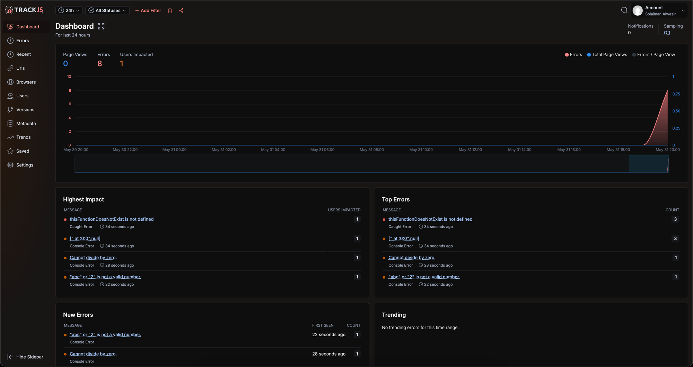

# Lab 9 - JavaScript Error Handling, Monitoring, & JS Docs

CSE 110 — Spring 2026

## Live site (GitHub Pages)

https://salwazir.github.io/Lab9_Starter/

## What this demonstrates

This page is an "Error Calculator" plus a row of buttons that each exercise a
different part of the JavaScript error-handling / monitoring toolkit.

### Step 2 — Console methods
Each button (except "Trigger a Global Error") calls its matching `console`
method on some sample data:

| Button | Method |
| --- | --- |
| Console Log | `console.log` |
| Console Error | `console.error` |
| Console Count | `console.count` |
| Console Warn | `console.warn` |
| Console Assert | `console.assert` |
| Console Clear | `console.clear` |
| Console Dir | `console.dir` |
| Console dirxml | `console.dirxml` |
| Console Group Start / End | `console.group` / `console.groupEnd` |
| Console Table | `console.table` |
| Start Timer / End Timer | `console.time` / `console.timeEnd` |
| Console Trace | `console.trace` |

Open DevTools → Console and click the buttons to see each one.

### Step 3 — try / catch / finally + throw
The calculator validates its inputs and `throw`s on bad data, divide-by-zero,
etc. Everything runs inside a `try / catch / finally` block. To see a realistic
caught error, comment out the `<output>` element in `index.html` and press
**Calculate** — `output.innerHTML` then throws a `TypeError` that the `catch`
block handles gracefully instead of breaking the page.

### Step 4 — Custom errors
`CalculatorError` extends the built-in `Error`, and `DivideByZeroError` extends
`CalculatorError`, so the calculator throws specific, named error types.

### Step 5 — Global error handler + 3rd-party monitoring
`window.onerror` and `window.addEventListener('error')` catch errors that escape
all `try/catch` blocks. The **Trigger a Global Error** button calls an undefined
function on purpose so those handlers fire and log to the console.

To enable **TrackJS** monitoring, sign up at <https://trackjs.com/>, then
uncomment the snippet in the `<head>` of `index.html` and paste in your token.
The TrackJS dashboard screenshot (with username + list of triggered errors) is
included in this repo as `trackjs.png`:

